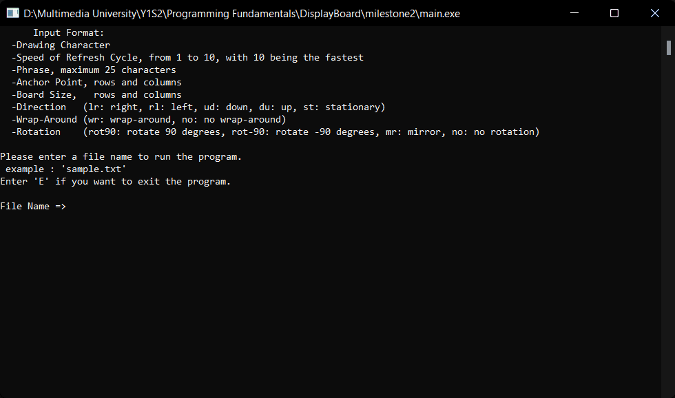

# DisplayBoard

A terminal display board written in C++.

Written for Year 1 Programming Fundamentals Assignment in Trimester 1 2019/2020.

This program allows users to display text in various styles. Customization includes the display message, size of the display board, message anchor dot, moving direction, time steps, speed, characters for drawing, wrap-around effects and rotated display.

Implemented basic error handling in cases of unrecognizable commands.

[Milestone 1](question/Assignment_Milestone1.pdf) | [Milestone 2](question/Assignment_Milestone2.pdf)

## Running the program

1. Clone this repo 

   ```
   git clone https://github.com/BingQuanChua/DisplayBoard.git
   ```

2. Run the `.exe` file 

## Milestone 1

Prompts user to input commands upon running the file. The size of the display board is fixed

Command includes: 
(1) the display message,  
(2) the anchor dot (point where the text starts), 
(3) moving direction (up, down, left, right, stationary), 
(4) time steps, and 
(5) speed.

## Milestone 2

Uses external input file commands with specific format. 
More customization features are included. 

Including the five commands from Milestone 1, users get to customize: 
(6) the drawing character, 
(7) the size of the display board,
(8) warp-around,
(9) rotation, and
(10) "inception” effect - where each character in the string is drawn using its own character.

Demo:

<details> 
    <summary>Sample Command (Click to show)</summary>
    
</details>